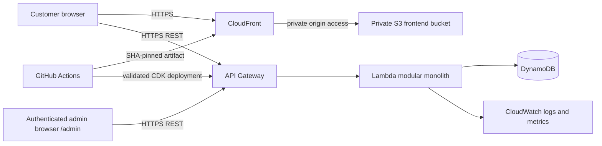

# Integrated Solution Design

Status: DESIGN PROPOSAL
Owner: Principal Software Engineer
Source of truth: `/docs/specs`
Last Updated: 2026-09-03

This document connects the approved product, API, data, frontend, backend, infrastructure, and delivery specifications into one implementable V1 design. It does not introduce new product behaviour. Where this document conflicts with an approved specification, the approved specification wins.

## 1. Scope and Outcomes

The solution provides two operational surfaces:

- A mobile-first customer draw flow that accepts a name, 10-digit phone number, and bill number.
- An Admin V1 operations page for campaign configuration, prize management, claim reporting, aggregate summaries, deletion, and CSV export. Read-only data is public; edits and exports require Cognito local-user authentication.

The core outcome is exactly one authoritative claim for each normalized bill during an active campaign. The customer interface presents the backend result through the festive gift box reveal; it never selects a prize or creates a claim ID.

V1 remains a modular monolith for one developer. There are no microservices, inventory counters, prize depletion rules, or application-level authentication flows beyond the approved Cognito Admin sign-in.

## 2. System Context



### Responsibilities

| Boundary           | Owns                                                                                     | Must not own                                                            |
| ------------------ | ---------------------------------------------------------------------------------------- | ----------------------------------------------------------------------- |
| Customer React app | Input feedback, request lifecycle, reveal presentation, accessibility, responsive layout | Eligibility, prize selection, claim ID, uniqueness, counters            |
| Admin React app    | Operations controls, filters, pagination, export interaction, status display             | Direct DynamoDB access, historical claim mutation, business-rule bypass |
| API Gateway        | HTTPS routing, explicit CORS, throttling, platform request limits                        | Prize selection or persistence rules                                    |
| Lambda backend     | Validation, campaign enforcement, selection, uniqueness, claims, aggregates, API mapping | Presentation decisions                                                  |
| DynamoDB           | Durable claims, configuration, uniqueness records, aggregate state                       | Client-side filtering or authority                                      |
| CDK and delivery   | Reproducible AWS resources and immutable artifact provenance                             | Runtime business decisions                                              |

## 3. Runtime Components and Modules

### Frontend

The React + TypeScript frontend contains separate customer and Admin route surfaces. Shared API types and small formatting utilities may be placed under `/shared`, but business rules remain in the backend.

Customer state is explicit:

```text
LANDING
  -> FORM
  -> CHECKING_ELIGIBILITY
  -> ANTICIPATION
  -> BOX_REVEAL
  -> RESULT
```

The successful response is stored as the sole reveal input. `ANTICIPATION` is visual-only and lasts approximately 0.8-1.2 seconds under normal motion. Reduced motion skips unnecessary waiting while preserving announcements, prize text, claim ID, and actions.

Non-success transitions are explicit and do not enter the winning reveal:

```text
CHECKING_ELIGIBILITY -> ALREADY_CLAIMED
CHECKING_ELIGIBILITY -> DRAW_ENDED
CHECKING_ELIGIBILITY -> NO_ELIGIBLE_PRIZE
CHECKING_ELIGIBILITY -> API_ERROR
CHECKING_ELIGIBILITY -> NETWORK_ERROR
API_ERROR / NETWORK_ERROR -> RETRY -> CHECKING_ELIGIBILITY
```

The active reveal uses a dedicated near-full-screen overlay. The gift box opens once per successful response, is keyboard operable, has a minimum 44x44px activation target, and moves focus intentionally into the overlay and then to the result. Backdrop dismissal is disabled while progression is active.

The Admin surface loads summary, campaign, prizes, and claims on entry. It uses compact operational controls, date-only pickers, bounded cursor pagination, prize-card filtering, explicit loading/error states, and a year-selection modal before CSV export. Admin Tailwind styles are isolated from customer styling.

### Backend

The Node.js + TypeScript Lambda is a modular monolith with these logical modules:

```text
route/controller
  -> request-size guard
  -> validator and normalization
  -> campaign service
  -> prize service / weighted selector
  -> claim service
  -> DynamoDB repository
  -> response mapper
```

The request-size guard runs before JSON business processing for in-scope JSON mutation endpoints. The raw body limit is 32,768 bytes and returns `413 REQUEST_TOO_LARGE` without executing mutations.

The claim service owns the transaction boundary. Controllers map domain outcomes to the approved HTTP and machine-readable response contract; they do not contain selection or persistence logic.

## 4. Customer Draw Sequence

```mermaid
sequenceDiagram
    actor Customer
    participant UI as React customer UI
    participant API as API Gateway
    participant Lambda as Draw Lambda
    participant DB as DynamoDB

    Customer->>UI: Enter name, phone, bill
    UI->>UI: Client validation and submit lock
    UI->>API: POST /api/draw
    API->>Lambda: Route request and apply platform controls
    Lambda->>Lambda: Enforce 32 KB body limit
    Lambda->>Lambda: Validate and normalize bill
    Lambda->>DB: Read campaign and active positive-weight prizes
    Lambda->>DB: Transactionally reserve normalized bill,
create claim, and update aggregates
    DB-->>Lambda: Created claim or conditional conflict
    Lambda-->>API: SUCCESS or approved error contract
    API-->>UI: HTTP response
    UI->>UI: ANTICIPATION, then BOX_REVEAL
    UI->>Customer: Reveal backend prize and claim ID
```

Processing rules:

1. Validate name, phone, and bill independently on the backend.
2. Interpret campaign dates in `Asia/Kolkata`; reject requests outside the configured inclusive date range.
3. Retrieve only active prizes with positive relative weights. If none are eligible, return `NO_ELIGIBLE_PRIZE` and perform no mutation.
4. Select the prize on the backend using relative weights.
5. Atomically enforce the normalized bill uniqueness condition, persist the immutable claim with a prize-name snapshot and server timestamp, and update claim-derived aggregates.
6. Return the selected prize and server-generated claim ID. The legacy `wheel.sectorPrizeIds` response field may remain for contract compatibility but is not used by the active gift box reveal.

A duplicate normalized bill returns the original claim details as `ALREADY_CLAIMED`. A retry correlation header may help associate retries, but it never replaces bill uniqueness.

## 5. Data and Consistency Design

The conceptual entities are Campaign, Prize, Claim, and claim-derived aggregates. The physical DynamoDB key and index design must support the approved access patterns without requiring a full browser-loaded claim scan.

### Claim creation invariant

The following effects are one business operation:

```text
unused normalized bill
  => one claim + one total increment + one daily increment + one prize increment
```

A conditional duplicate-bill conflict is not retried as an infrastructure failure. Transient DynamoDB transaction contention may use bounded backoff and retry, but every retry must preserve the same exactly-once outcome.

### Deletion invariants

- Deleting one claim atomically removes or releases its normalized bill and decrements total, daily, and prize aggregates.
- Clearing claims removes all claim-derived records and resets claim-derived aggregates.
- Prize and campaign configuration survive claim deletion.
- Historical claims preserve the awarded prize snapshot until explicit deletion.

### Reporting

Summary reads use aggregate records for total successful spins, today’s `Asia/Kolkata` count, prize distribution, and available export years. Claims are listed newest-first with bounded pages and opaque continuation tokens. The CSV export is explicitly scoped to one selected calendar year based on the claim timestamp interpreted in `Asia/Kolkata`, and is independent of active on-screen claim filters.

## 6. API Surface

| Endpoint                              | Purpose                                   | Key result                                                               |
| ------------------------------------- | ----------------------------------------- | ------------------------------------------------------------------------ |
| `POST /api/draw`                      | Customer participation                    | `SUCCESS`, `ALREADY_CLAIMED`, lifecycle, validation, or failure response |
| `GET /api/admin/summary`              | Dashboard aggregates and export years     | Summary, campaign status, available years                                |
| `GET /api/admin/campaign`             | Read campaign configuration               | From date, To date, status                                               |
| `PATCH /api/admin/campaign`           | Configure date-only campaign range        | Updated campaign or validation error                                     |
| `GET /api/admin/prizes`               | Read all prize configuration              | Active and inactive prizes                                               |
| `POST /api/admin/prizes`              | Add a prize                               | Created prize                                                            |
| `PATCH /api/admin/prizes/{prizeId}`   | Change weight or active state             | Updated prize                                                            |
| `GET /api/admin/claims`               | Bounded reporting query                   | Claims, total, opaque next token                                         |
| `DELETE /api/admin/claims/{claimId}`  | Delete one claim                          | Updated summary                                                          |
| `DELETE /api/admin/claims`            | Clear all claims after typed confirmation | Reset summary                                                            |
| `GET /api/admin/claims.csv?year=YYYY` | Export one calendar year                  | Approved CSV fields only                                                 |

All timestamps returned by APIs are ISO 8601 UTC strings. API errors expose approved status and code values without database, AWS, or secret details. CORS allows only approved frontend origins, and API Gateway throttling remains enabled.

## 7. Security and Privacy

- The frontend S3 bucket is private; CloudFront is the public asset entry point.
- IAM permissions are resource-scoped and function-specific.
- Admin V1 uses Cognito local users through Hosted UI with OAuth2 Authorization Code + PKCE. MFA and external identity providers are disabled in V1.
- Admin list responses mask phone numbers. CSV contains only approved fields and formula-sensitive values receive apostrophe prefixing before CSV quoting.
- Logs use correlation identifiers and operational outcomes without unnecessary customer PII or raw request bodies.
- Oversized request logging records route, method, observed size when available, and correlation ID, but never body content.
- Prize selection, bill uniqueness, claim IDs, campaign enforcement, and aggregate updates are never trusted to the client.

## 8. Infrastructure and Delivery

AWS CDK defines the private S3 bucket, CloudFront distribution, API Gateway, Lambda runtime, DynamoDB tables, IAM policies, and CloudWatch resources. Taggable resources include `project=lucky-draw` and `organization=dutta-brothers`. Production persistent data uses protective removal policies.

GitHub Actions checks out the triggering Git SHA, runs validation, creates one SHA-identified artifact containing the validated backend package and frontend assets, and deploys that artifact to staging. Staging does not rebuild source independently. Deployment summaries and smoke verification record the deployed SHA. Frontend cache policy must ensure the SPA entry document cannot point at an older asset bundle.

The Admin SPA build receives the public Cognito Hosted UI domain and app-client ID as `VITE_COGNITO_DOMAIN` and `VITE_COGNITO_CLIENT_ID`. The two local Admin users are provisioned separately after stack creation; passwords are never stored in source or build configuration.

Performance verification is staging-only, requires the exact typed confirmation `RUN_PERFORMANCE_TEST` for live execution, supports offline dry runs, and never mutates infrastructure or campaign configuration.

## 9. Failure and Recovery Behaviour

| Condition                     | API outcome                                     |                                  Mutation allowed | Customer/Admin action                    |
| ----------------------------- | ----------------------------------------------- | ------------------------------------------------: | ---------------------------------------- |
| Invalid input                 | `400 VALIDATION_ERROR`                          |                                                No | Show field or actionable error           |
| Body over 32 KB               | `413 REQUEST_TOO_LARGE`                         |                                                No | Correct and resubmit; no automatic retry |
| Campaign outside date range   | `409 DRAW_ENDED`                                |                                                No | Show ended guidance                      |
| No eligible prize             | `409 NO_ELIGIBLE_PRIZE`                         |                                                No | Show unavailable guidance                |
| Existing normalized bill      | `200 ALREADY_CLAIMED`                           |                                      No new claim | Show original claim details              |
| Transient DynamoDB contention | Bounded retry, then internal error if exhausted |                At most one successful transaction | Retry only through approved request flow |
| API failure                   | Approved `API_ERROR` mapping                    |                        No assumed client mutation | Explicit retry state                     |
| Network failure               | `NETWORK_ERROR`                                 | Unknown to client; bill uniqueness protects retry | Retry same request safely                |

The client must never infer `SUCCESS` from a timeout. It retries the same customer request and accepts `ALREADY_CLAIMED` as the authoritative recovery result.

## 10. Verification and Traceability

| Design property                   | Primary verification                                                   |
| --------------------------------- | ---------------------------------------------------------------------- |
| Validation and normalization      | Backend validation tests and frontend form tests                       |
| One bill, one claim               | Conditional/transaction tests, concurrent duplicate tests, retry tests |
| Weighted selection                | Selector ratio and eligible-prize tests                                |
| Aggregate exactly-once behavior   | Success, duplicate, contention, deletion, and failure-path tests       |
| Gift box result consistency       | Reveal tests for every configured prize and claim ID                   |
| Accessibility and mobile behavior | React Testing Library plus 360/375/390/430 responsive checks           |
| Admin filtering and export        | Search, cursor, year boundary, CSV injection, and masking tests        |
| Request-size policy               | Below, exact, above-limit tests for every in-scope mutation family     |
| Infrastructure security           | CDK tests, synth, IAM review, and deployment smoke checks              |
| Deployment provenance             | SHA/artifact assertions and staging verification                       |
| Operational performance           | Staging-only approved scenario runner                                  |

Before implementation is accepted, run the repository quality gates: workspace lint, typecheck/build, Vitest suites, production build, CDK tests, and `cdk synth`. Infrastructure is not considered deployed unless an explicitly approved deployment succeeds and staging verification confirms the expected Git SHA.

## 11. Decisions and Boundaries

- **Chosen:** one modular monolith with clear frontend, backend, shared-contract, and infrastructure boundaries.
- **Chosen:** DynamoDB transaction/conditional-write semantics for bill uniqueness and aggregate consistency.
- **Chosen:** gift box as the active customer reveal; wheel data is compatibility-only.
- **Chosen:** Cognito local-user authentication for Admin V1 with no MFA or external identity provider.
- **Rejected:** client-side prize selection, prize inventory management, microservices, analytics databases, full claim scans for dashboard metrics, and unrelated AWS services.

This design is ready for Principal Engineer review and phase-by-phase implementation against the approved acceptance criteria.
