# System Architecture and Flows

Visual reference for the **implemented** system. Every diagram is derived from the source
in `frontend/`, `backend/` and `infrastructure/`.

Product behaviour remains defined by `/docs/specs`. If a diagram here ever contradicts an approved
specification, the specification wins and this document must be corrected.

## Contents

1. [System context](#1-system-context)
2. [Deployed AWS architecture](#2-deployed-aws-architecture)
3. [Backend module structure](#3-backend-module-structure)
4. [Customer draw flow](#4-customer-draw-flow)
5. [Draw decision logic](#5-draw-decision-logic)
6. [Atomic claim persistence and retry](#6-atomic-claim-persistence-and-retry)
7. [Frontend UI state machine](#7-frontend-ui-state-machine)
8. [Envelope reveal state machine](#8-envelope-reveal-state-machine)
9. [Admin flows](#9-admin-flows)
10. [DynamoDB single-table design](#10-dynamodb-single-table-design)
11. [CI and deployment pipeline](#11-ci-and-deployment-pipeline)
12. [Local quality gate](#12-local-quality-gate)

---

## 1. System context

Who uses the system and what it talks to. The backend is authoritative for every
business-critical decision; the browser is never trusted for prize selection, claim IDs,
eligibility or duplicate prevention.

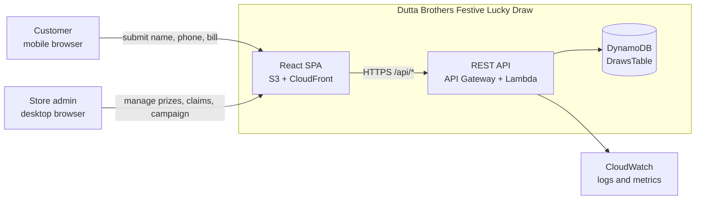

---

## 2. Deployed AWS architecture

Defined in `infrastructure/lib/foundation-stack.ts`. One stack per stage:
`DuttaDrawFoundationStackDev`, `...Staging`, `...Prod`.

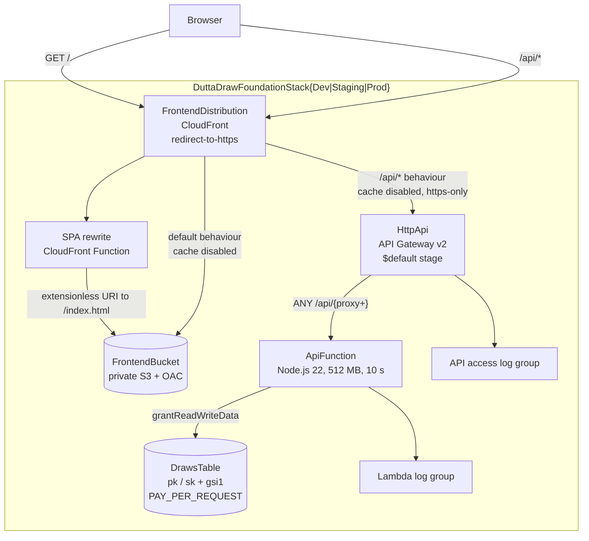

Stage-dependent settings, resolved from CDK context:

| Setting                         | Dev       | Staging   | Production             |
| ------------------------------- | --------- | --------- | ---------------------- |
| `apiThrottleRateLimit`          | 25        | 75        | 150                    |
| `apiThrottleBurstLimit`         | 50        | 150       | 300                    |
| Removal policy                  | `DESTROY` | `DESTROY` | `RETAIN`               |
| DynamoDB point-in-time recovery | off       | off       | on                     |
| `frontendOrigin` context        | required  | required  | required, no localhost |

CORS is restricted to the single configured frontend origin, allowing only
`content-type` and `idempotency-key` headers.

---

## 3. Backend module structure

The same route table and business logic serve both runtimes. `APP_RUNTIME` selects the
store implementation, so local development never touches AWS.

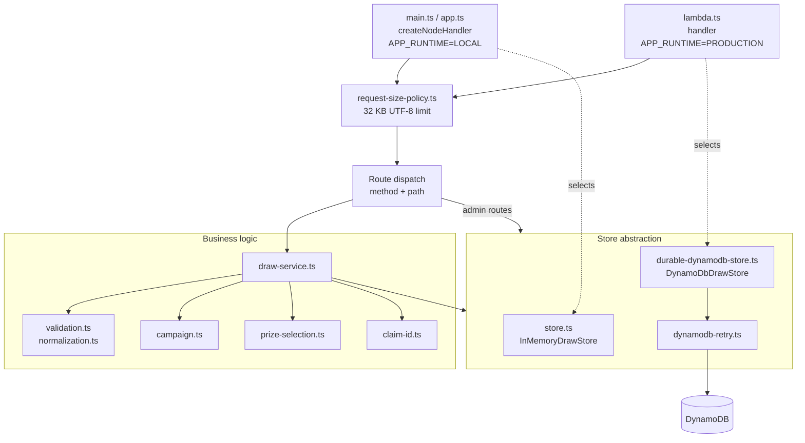

---

## 4. Customer draw flow

Happy path for `POST /api/draw`, from tap to revealed prize.

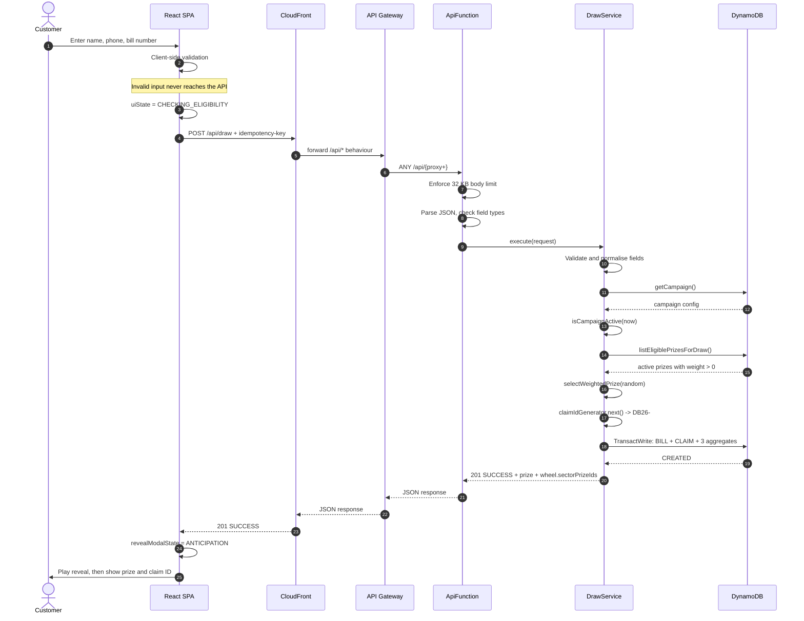

The API returns the prize the backend already committed. The reveal animation is
presentation only and always renders the response it was given.

---

## 5. Draw decision logic

Every branch and response the draw endpoint can produce, in evaluation order
(`request-size-policy.ts`, `lambda.ts`, `draw-service.ts`).

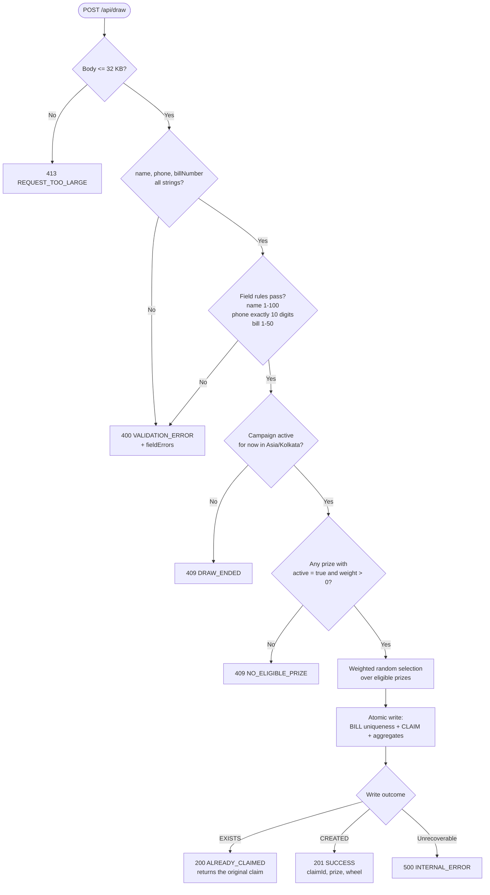

Duplicate detection keys on the **normalised bill number** (trimmed and uppercased), so
casing and padding differences cannot produce a second claim for the same bill.

---

## 6. Atomic claim persistence and retry

`DynamoDbDrawStore.createClaimAndUpdateAggregatesAtomic` writes five items in a single
`TransactWriteItems` call. Only the first two carry conditions, which is what makes a
cancellation unambiguously classifiable.

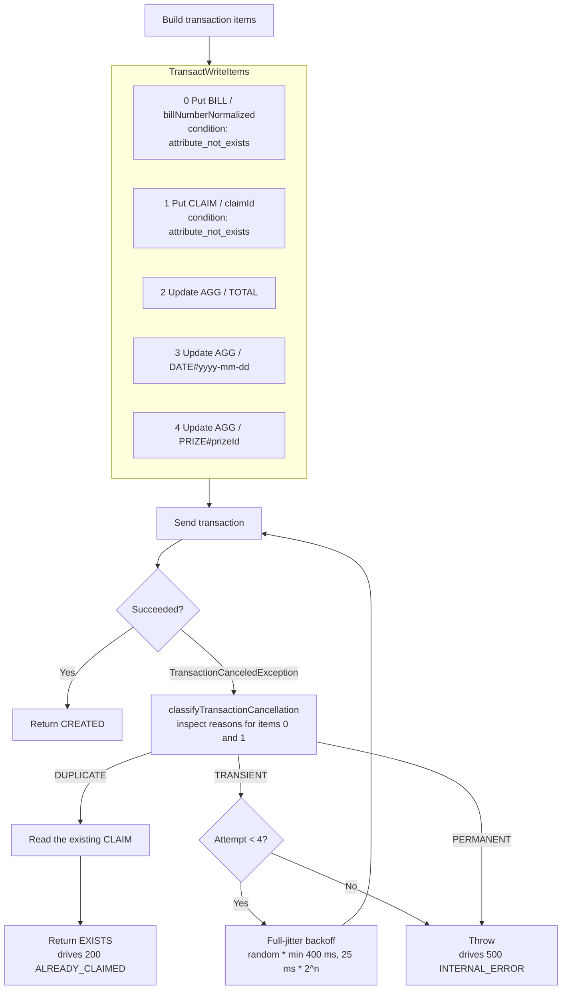

A conditional-check failure on the BILL or CLAIM item means a genuine duplicate.
A transaction conflict or throttle is transient and is retried. Anything else fails fast.

---

## 7. Frontend UI state machine

`UiState` in `frontend/src/App.tsx`. This governs which screen is shown and whether the
submit button is enabled.

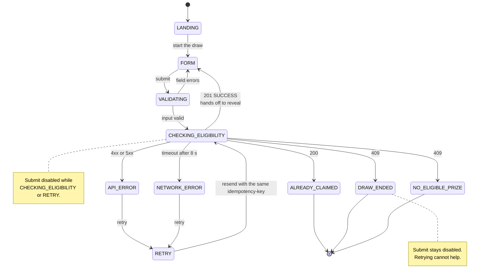

---

## 8. Envelope reveal state machine

`RevealModalState` plus the presentation phases in `frontend/src/App.tsx`. Timings collapse
when the browser reports `prefers-reduced-motion: reduce`.

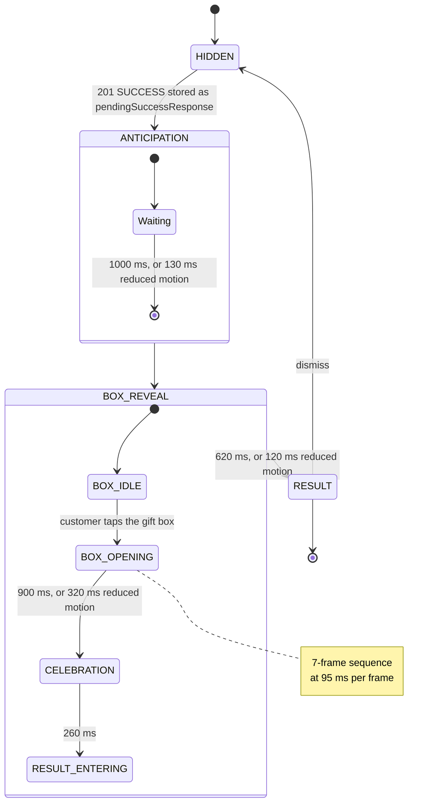

The reveal never decides the prize. It renders `pendingSuccessResponse`, so the animation
and the persisted claim can never disagree.

---

## 9. Admin flows

Admin V1 has no token authentication; access is controlled by keeping the route private
(see `docs/architecture/ADR-004-private-admin-v1.md`).

### Dashboard load and claims paging

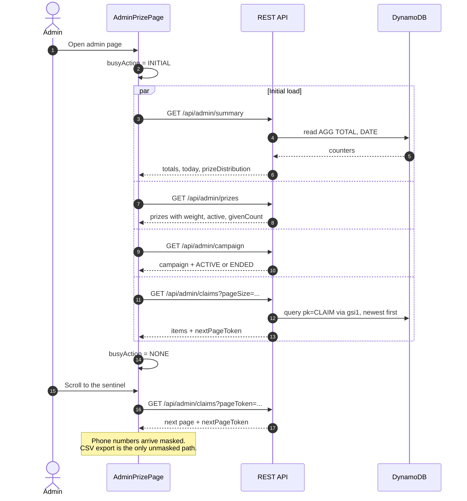

### Prize and campaign administration

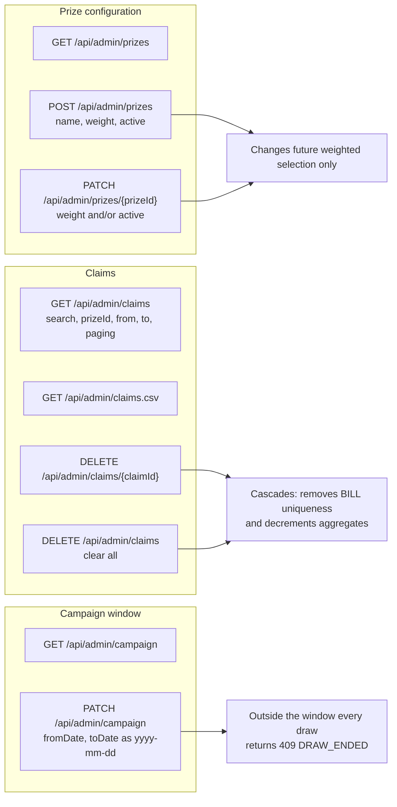

Prize edits never rewrite history: each claim stores its own snapshot of the prize name.

---

## 10. DynamoDB single-table design

One table, `DrawsTable`, with `pk` / `sk` and a single GSI `gsi1` for
timestamp-ordered claim listing.

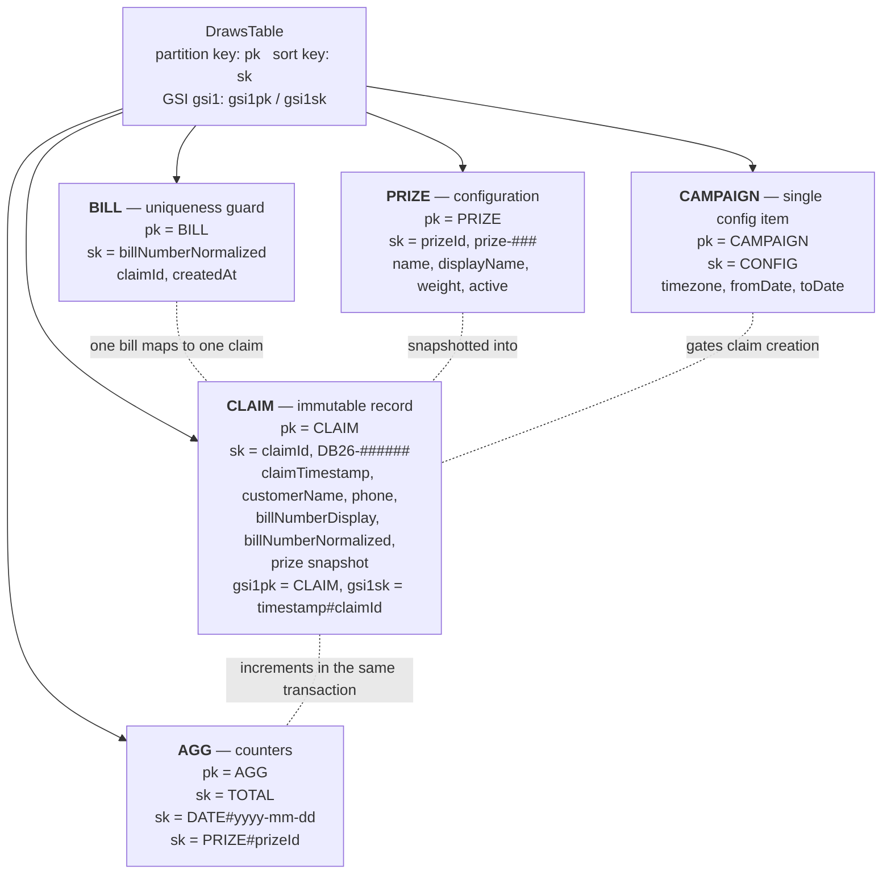

| Access pattern             | Operation                              |
| -------------------------- | -------------------------------------- |
| Has this bill been used?   | `Get pk=BILL, sk=billNumberNormalized` |
| Create a claim atomically  | `TransactWrite` over 5 items           |
| Fetch one claim            | `Get pk=CLAIM, sk=claimId`             |
| List claims, newest first  | `Query gsi1 pk=CLAIM`                  |
| Eligible prizes for a draw | `Query pk=PRIZE`, filter in memory     |
| Dashboard totals           | `Get pk=AGG, sk=TOTAL`                 |
| Today's spins              | `Get pk=AGG, sk=DATE#today`            |
| Prize distribution         | `Query pk=AGG, sk begins_with PRIZE#`  |
| Campaign window            | `Get pk=CAMPAIGN, sk=CONFIG`           |

Counters are maintained transactionally with the claim, so reporting never scans the table.

---

## 11. CI and deployment pipeline

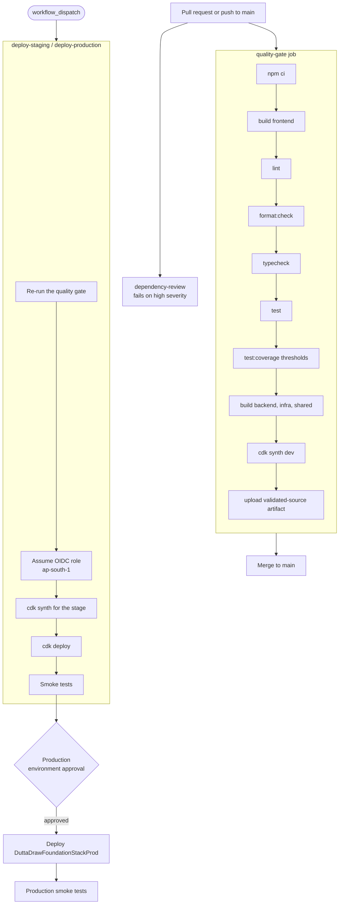

Deployment is manual by design. No workflow deploys on merge.

---

## 12. Local quality gate

Husky hooks mirror CI so failures surface before a pull request exists. They do not replace
CI, which remains authoritative.

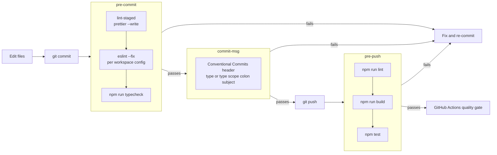
